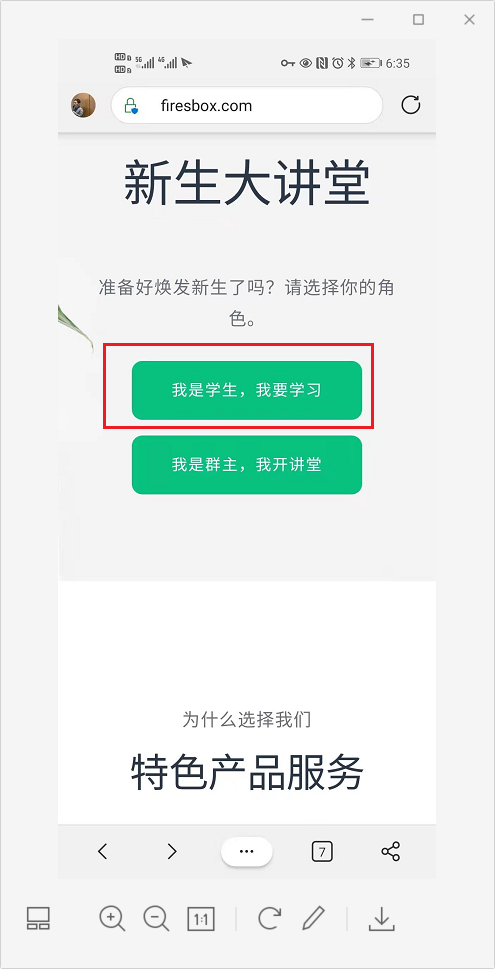
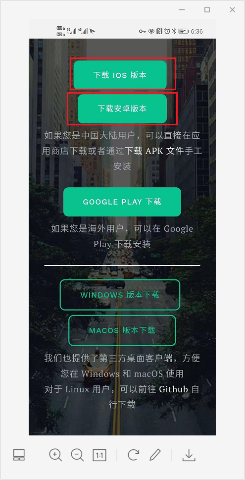

# 下载新生大讲堂

## 1、新生大讲堂APP
Mixin Messenger 钱包是 Mixin Network 上的第一个 Dapp，基于 Mixin Network 标准 API 开发，Mixin Messenger 钱包致力于成为区块链世界里的微信，让普通人可以以极其简单的方式进入区块链世界。

> Mixin Network 是一个面向数字资产的闪电网络，采用 BFT-DAG 机制，实现了转账 0 费用、1 秒到账、支付匿名、可无限扩展，详细信息大家可以参考Mixin官网（https://mixin.one）。

Mixin Messenger 本身由中心化的聊天 + 去中心化的 Mixin Network 钱包组成，在Mixin公链上，也就是 Mixin Messenger 内可以搭建包含各种功能的小程序机器人（相当于微信里的小程序）；并在 Mixin Messenger 上实现聊天、发红包、交易、购物、发布文章、建立小密圈、听课等功能 ...... 

新生大讲堂APP 可以理解为是 Mixin Messenger 在国内的合规版本，服务器在国内，有更好的网络稳定性，软件内容与 Mixin Messenger 一致。因此，为了更好的下载与用户体验，建议大家使用新生大讲堂APP ，其功能与 Mixin Messenger 相同。

## 2、新生大讲堂APP的主要功能

新生大讲堂主要功能有数字货币钱包和BOX定投践行群。

数字货币钱包现已对接了13条主链，超过5万种数字资产。私钥保护密码采用了6位PIN码方式进行分布式存储，既安全又方便新手使用。

新生大讲堂APP中主群——BOX定投践行群，目前已经开设了李笑来的定投课程、刘晓燕的逻辑课程、李骏的编程课程、王渊源的英语课程、廖智的幸福课程等等，而且课程还在不断增加中。截至目前定投践行群已经有7000+的长期主义者加入，每个人不仅都赚到了钱，而且还收获了成长。

## 3、如何下载新生大讲堂

访问firesbox.com下载手机或电脑客户端。具体步骤如下：
1、访问新生大讲堂首页，点击【我是学生，我要学习】；

2、选择对应的新生大讲堂版本进行下载、安装；

> 值得提醒的是如果您喜欢使用电脑进行学习，可以下载对应的客户端版本，享受更高质量的课程学习。

