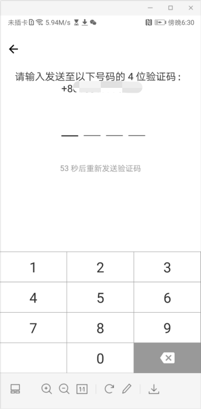
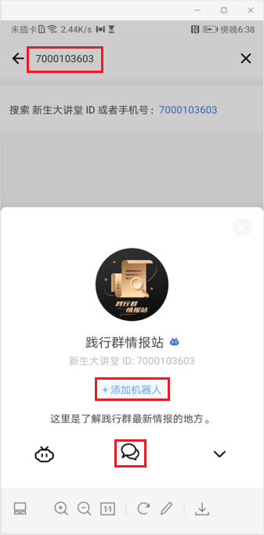
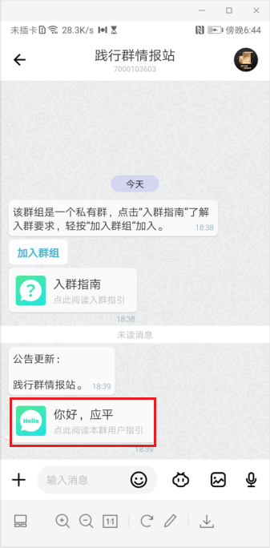

# 如何加入新生大讲堂

## 前提条件：
请确保您已经下载了新生大学（firesbox.com/app）。

## 1、注册新生大学APP
输入手机号和验证码，填写昵称，完成新生大学注册。

## 2、加入践行群情报站
在新生大学APP首页右上角搜索框输入7000103603，点击【+添加机器人】，再点击底部中间的【对话按钮】。

## 3、加入群组

进入对话界面，点击【加入群组】，在弹出的界面依次点击【登录】、【确认】按钮授权群组使用您的账号。

## 4、常见功能

点击阅读本群用户指引，学习常见功能。

恭喜你现在已经掌握了新生大学机器人的用法，后面你就可以通过一些渠道加入到你感兴趣的群组了。